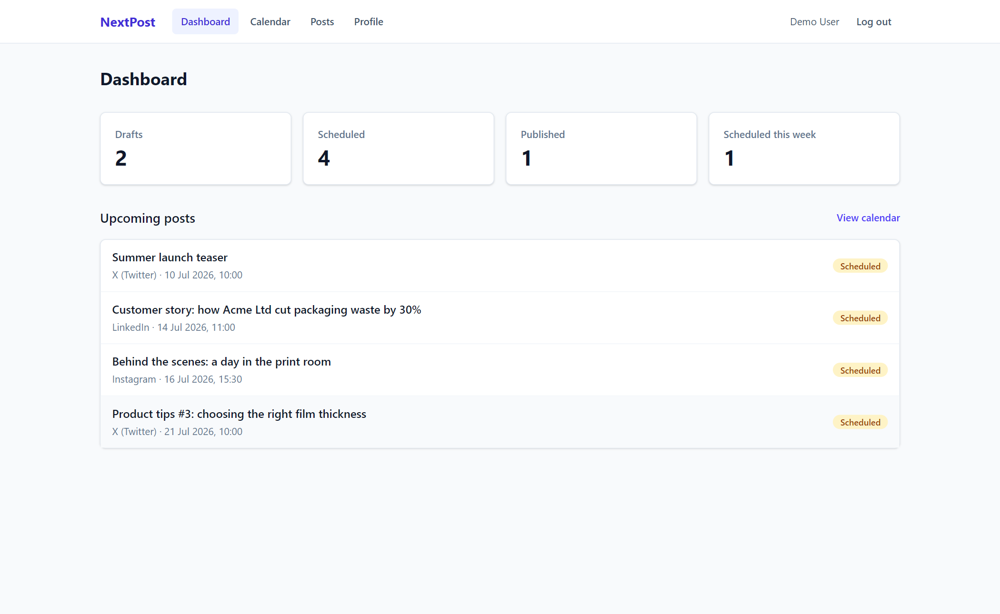
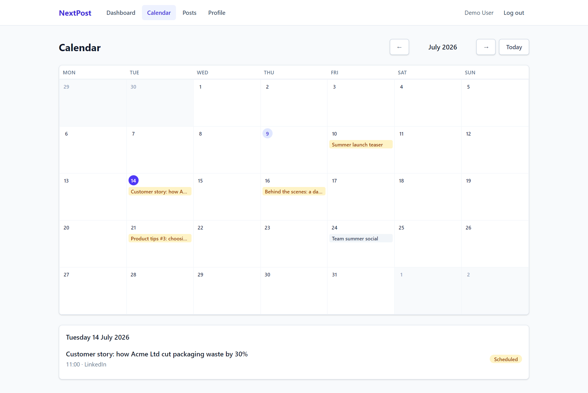
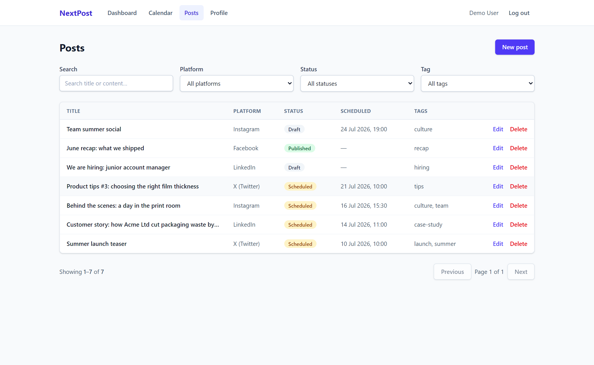
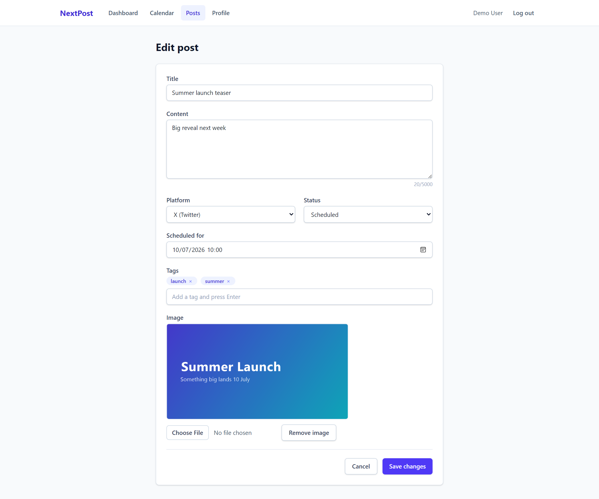
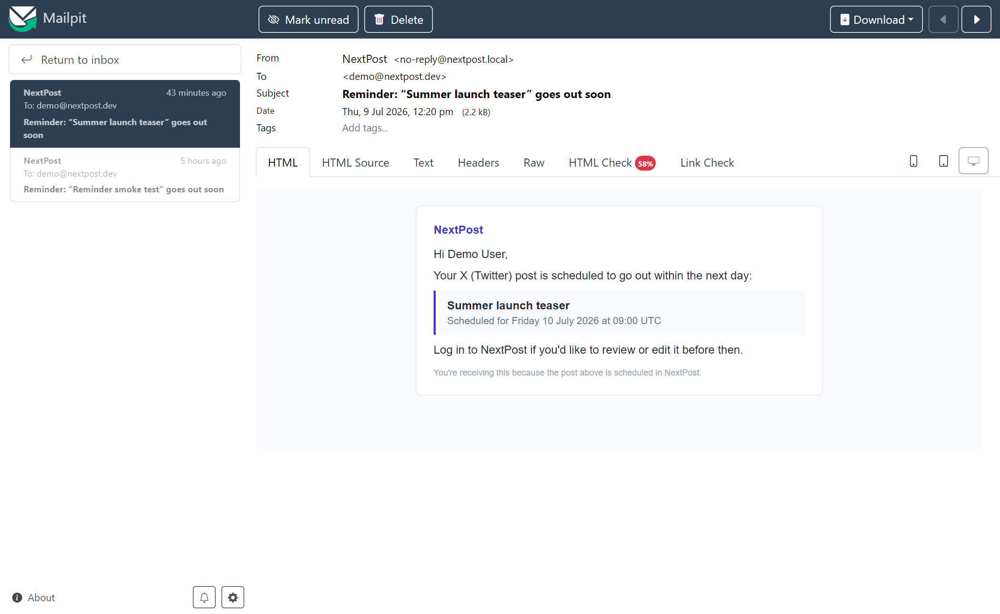
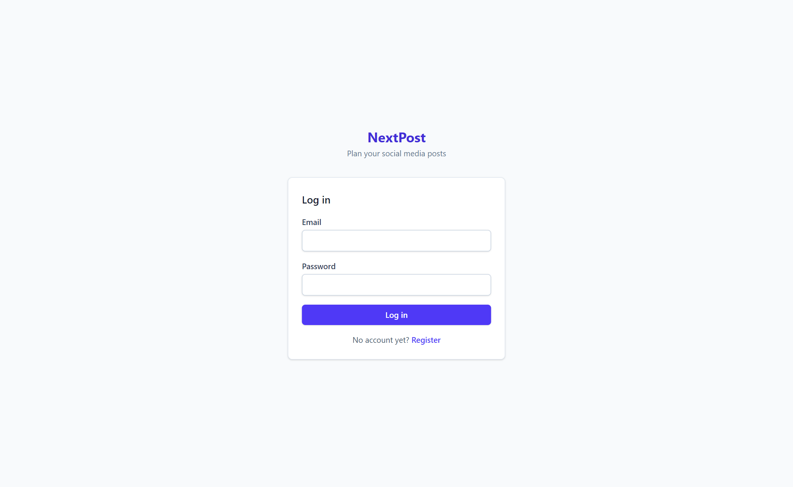
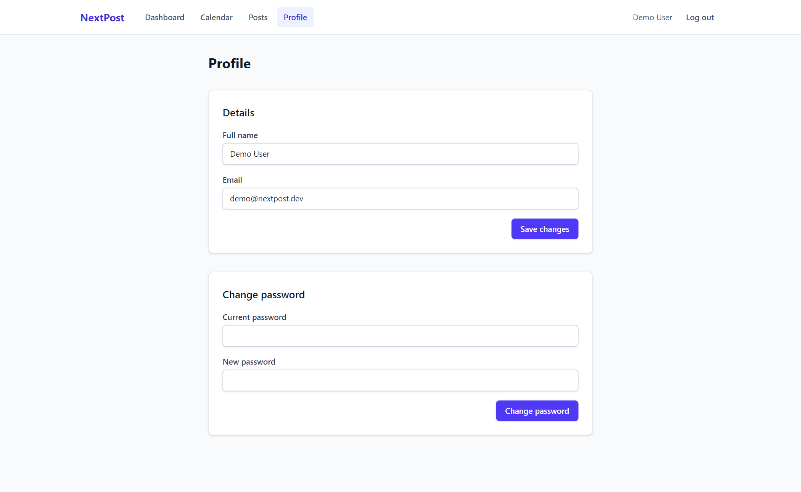
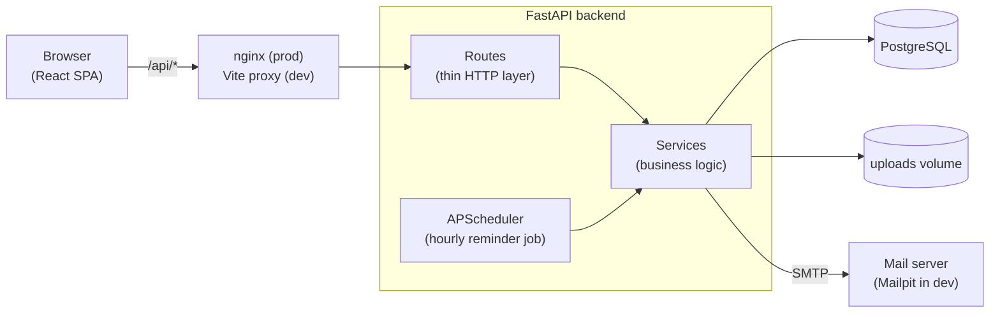

# NextPost

**A lightweight social media planning app for small marketing teams — the spreadsheet
replacement that knows what a schedule is.**

NextPost lets a marketing team plan their social media content in one place: draft posts,
schedule them, attach an image, browse the plan as a calendar or a filterable list, and get
an email reminder the day before anything goes out. It manages **planning only** — it does
not publish to social networks, and that's deliberate.

## The problem

Small marketing teams routinely plan their posting schedule in a spreadsheet: one row per
post, columns for date, platform, copy and status, colour-coding by hand, and no reminders
unless someone sets a calendar event. It works — until two people edit at once, images live
in a separate folder, "did this actually go out?" becomes a Slack thread, and nobody trusts
the colours anymore.

NextPost replaces exactly that spreadsheet: the same information, structured, validated,
multi-user, with a calendar view and automatic reminders.

## Why it's intentionally small

This is a portfolio project, and its goal is to demonstrate **production-quality
engineering on a focused scope** rather than a feature checklist. Publishing integrations,
analytics, team roles and AI copywriting are all deliberately excluded (see
[Future improvements](#future-improvements)) so that what *is* here — auth, CRUD with real
search/filtering, file uploads, background jobs, tests, Docker — could be built properly:
layered, tested, documented, and deployable. Every significant decision has a written
rationale in [docs/adr](docs/adr).

## Screenshots

**Dashboard** — summary counts and what's going out next:



**Calendar** — monthly plan, click a day for its posts (a ~150-line custom component, not a
calendar library — [ADR 0008](docs/adr/0008-custom-month-calendar.md)):



**Posts** — searchable, filterable, sortable list:



**Post editor** — validation, tag chips, scheduling, and image upload with preview:



**Reminder email** — sent by the background scheduler the day before a post is due
(Mailpit dev inbox):



<table>
  <tr>
    <td width="50%"></td>
    <td width="50%"></td>
  </tr>
</table>

## Tech stack

| Layer | Technology |
|---|---|
| Backend | Python 3.12 · FastAPI · SQLAlchemy 2.0 · Alembic · Pydantic v2 |
| Database | PostgreSQL 16 |
| Background jobs | APScheduler (in-process — deliberately not Celery) |
| Frontend | React 19 · TypeScript · Vite · TanStack Query · React Hook Form · Tailwind CSS 4 |
| Auth | JWT (single access token) · bcrypt |
| Email | stdlib SMTP · Mailpit in development |
| Testing | pytest (real PostgreSQL) · Vitest + React Testing Library |
| Infrastructure | Docker Compose (dev + prod) · nginx · GitHub Actions (CI) |

## Architecture



Three backend layers with strict responsibilities: **routes** translate HTTP to service
calls and domain exceptions back to status codes; **services** own business logic and never
import FastAPI; **models** are SQLAlchemy 2.0 typed ORM classes. There is deliberately no
repository layer — with this schema size, SQLAlchemy's `Session` *is* the data-access
abstraction. The scheduler is wired in the app lifespan but shares the same service layer,
so reminder logic is plain, testable Python.

On the frontend, **TanStack Query owns all server state** (no Redux, no API data in
Context), React Context carries only the auth token, and React Hook Form drives the forms
including cross-field validation and mapping of API 422 errors onto fields.

The full write-up — request lifecycles, auth flow, the reminder pipeline, the image
pipeline, dev/prod topology — is in **[docs/architecture.md](docs/architecture.md)**.
The database schema and ERD are in
**[docs/database-schema.md](docs/database-schema.md)**.

## Key architectural decisions

Each has a full ADR with context and trade-offs in [docs/adr](docs/adr):

| Decision | Short version | ADR |
|---|---|---|
| Sync SQLAlchemy | Async buys nothing at this scale and complicates everything | [0002](docs/adr/0002-sync-sqlalchemy.md) |
| Single JWT, no refresh tokens | Right-sized auth for an internal tool; trade-offs documented | [0003](docs/adr/0003-single-jwt-access-token.md) |
| APScheduler, not Celery | One periodic query doesn't justify a broker + workers | [0004](docs/adr/0004-apscheduler-for-background-jobs.md) |
| VARCHAR + CHECK enums, integer PKs | Enum changes become constraint swaps, not `ALTER TYPE` | [0005](docs/adr/0005-database-schema-conventions.md) |
| Pagination envelope, sort whitelist, ILIKE search | Consistent, injection-proof list endpoints | [0006](docs/adr/0006-list-endpoint-conventions.md) |
| TanStack Query + minimal Context + RHF | One owner per piece of state | [0007](docs/adr/0007-frontend-state-and-forms.md) |
| Custom month calendar | ~150 lines beat a library configured to disable itself | [0008](docs/adr/0008-custom-month-calendar.md) |
| Isolated image service, authenticated serving | Content-derived MIME types, no orphaned files, swappable storage | [0009](docs/adr/0009-image-storage-and-serving.md) |
| At-least-once reminders | Failed sends retry; `reminder_sent_at` makes runs idempotent | [0010](docs/adr/0010-reminder-delivery-semantics.md) |
| Real-DB tests + workflow tests, no browser E2E | Coverage as gap-finder, not target | [0011](docs/adr/0011-testing-strategy.md) |
| Multi-stage images, non-root, named volumes | Dev/prod from one Dockerfile without drift | [0012](docs/adr/0012-production-containerisation.md) |

## Repository structure

```
NextPost/
├── backend/
│   ├── app/
│   │   ├── api/            # HTTP layer: routes + dependencies (thin by rule)
│   │   ├── core/           # settings, security (JWT/bcrypt), JSON logging
│   │   ├── db/             # engine, session factory, declarative base
│   │   ├── models/         # SQLAlchemy ORM models + enums
│   │   ├── schemas/        # Pydantic request/response models
│   │   ├── services/       # business logic — framework-free, fully tested
│   │   └── scheduler.py    # APScheduler wiring (started from the app lifespan)
│   ├── alembic/            # database migrations
│   ├── tests/              # unit + API tests, run against real PostgreSQL
│   └── Dockerfile          # multi-stage: dev / builder / production targets
├── frontend/
│   ├── src/
│   │   ├── api/            # typed Axios wrappers — the seam mocked in tests
│   │   ├── components/     # shared UI (layout, dialogs, states, badges)
│   │   ├── context/        # auth context (token + login/logout, nothing else)
│   │   ├── features/       # posts (form, filters, tags), calendar
│   │   ├── hooks/          # TanStack Query hooks with central query keys
│   │   ├── lib/            # date helpers, API-error mapping, style constants
│   │   └── pages/          # route components (+ workflow tests in App.*)
│   ├── Dockerfile          # node build → unprivileged nginx
│   └── nginx.conf
├── docs/                   # ADRs, architecture doc, ERD, screenshots
├── docker-compose.yml      # development stack (hot reload, Mailpit)
├── docker-compose.prod.yml # production stack (built images, named volumes)
└── Makefile                # make dev / test / lint / check / prod-up
```

## API documentation

The API is self-documenting: with the stack running, **Swagger UI** is at
[http://localhost:8001/docs](http://localhost:8001/docs) (interactive — authorize with a
Bearer token from `POST /api/v1/auth/login`) and the raw OpenAPI schema at
`/openapi.json`. All endpoints live under `/api/v1`; list endpoints share a
`{items, page, page_size, total}` envelope.

## Getting started (development)

Prerequisites: Docker Desktop (and optionally `make`).

```bash
git clone https://github.com/AMirandaCodes/NextPost.git
cd NextPost
cp .env.example .env        # then set a real SECRET_KEY (see comment in the file)

docker compose up -d --build                            # or: make dev-build
docker compose run --rm backend alembic upgrade head    # or: make migrate
```

| Service | URL |
|---|---|
| App | http://localhost:5174 |
| API + Swagger | http://localhost:8001/docs |
| Mail inbox (Mailpit) | http://localhost:8025 |

Register an account in the app and start planning. Host ports are offset (5174/8001/5433)
so NextPost can run alongside other local stacks. The frontend hot-reloads (the compose
file enables polling so file watching works across Windows/macOS bind mounts); the backend
runs uvicorn `--reload`.

## Running tests & lint

```bash
# Backend (~120 tests against a real PostgreSQL test database)
docker compose run --rm backend pytest
docker compose run --rm backend pytest --cov=app --cov-report=term-missing   # coverage
docker compose run --rm backend ruff check .    # lint

# Frontend (component tests + full user-workflow tests)
docker compose run --rm frontend npm test
docker compose run --rm frontend npx vitest run --coverage                   # coverage
docker compose run --rm frontend npm run lint       # ESLint (zero warnings)
docker compose run --rm frontend npm run type-check # tsc --noEmit
```

Or, with make: `make test`, `make lint`, or `make check` for everything at once.

The testing approach — real DB for backend tests, API-module mocking + workflow tests for
the frontend, coverage as a gap-finder rather than a target — is documented in
[ADR 0011](docs/adr/0011-testing-strategy.md).

## Production deployment

```bash
cp .env.example .env   # set SECRET_KEY, a strong POSTGRES_PASSWORD and real SMTP settings
docker compose -f docker-compose.prod.yml up -d --build
docker compose -f docker-compose.prod.yml run --rm backend alembic upgrade head
```

Or `make prod-up` (which runs the migrations for you). The app is served on
`HTTP_PORT` (default 80).

The production stack ([ADR 0012](docs/adr/0012-production-containerisation.md)) differs
from development deliberately:

| | Development | Production |
|---|---|---|
| Frontend | Vite dev server, hot reload | Static build served by unprivileged nginx |
| Backend | `--reload`, source bind mount | Slim multi-stage image, non-root, no mounts |
| Ports | app 5174, API 8001, DB 5433, mail 8025 | only nginx (`HTTP_PORT`) is published |
| Email | Mailpit inbox | Real SMTP via environment variables |

**Persistent storage:** two named volumes hold all state — `pgdata` (PostgreSQL) and
`uploads` (post images at `/app/uploads`). Containers can be stopped, recreated or rebuilt
without losing data; only `docker compose -f docker-compose.prod.yml down -v` deletes the
volumes. Back up by dumping the database (`pg_dump`) and archiving the uploads volume.

**Scaling note:** the backend intentionally runs a single uvicorn worker — the reminder
scheduler lives in-process, and a second worker would send duplicate emails (ADR 0004).
TLS termination is expected to happen in front of nginx (reverse proxy or PaaS).

## Future improvements

Realistic next steps, intentionally left out to keep the project focused:

- **Generated API client** — derive the frontend's types and API functions from the
  OpenAPI schema instead of maintaining them by hand.
- **Object storage for images** — swap the local-disk `image_service` for S3-compatible
  storage; the service seam exists for exactly this (ADR 0009).
- **Celery** — if the app ever runs multiple backend instances, the scheduler moves out of
  process (the migration path is documented in ADR 0004).
- **Token revocation** — a denylist table would let password changes invalidate existing
  sessions (trade-off accepted in ADR 0003).
- **URL-state filters** — make filtered post lists shareable/bookmarkable.
- **`pg_trgm` search** — the upgrade path if ILIKE ever becomes slow (ADR 0006).
- **Reminder retry budget** — a permanently failing address currently retries each run
  until the post's date passes; a backoff column would cap that (ADR 0010).
- **Browser E2E suite** — the revisit trigger is real users (ADR 0011).

## Engineering decisions & lessons learned

Things this project taught (or confirmed) that are worth discussing:

- **Right-size the infrastructure.** The email reminder is one hourly query — APScheduler
  in-process does it with zero extra containers, and the constraint it imposes (one
  backend worker) is enforced in the Dockerfile CMD and documented. Celery would have been
  résumé-driven engineering here.
- **A small custom component can beat a big dependency.** The month calendar is ~150 lines
  on `date-fns` — semantic `<table>`, accessible day buttons, timezone-correct for free —
  versus a calendar library whose main features (drag-drop, week views) were all excluded
  requirements.
- **Workflow tests earn their keep.** A full login→create→edit→delete test mounted on the
  real route tree exposed a race where the post-login redirect to the originally requested
  page silently never worked — invisible to every component test, found the day the
  workflow test was written.
- **Validate uploads by what they are, not what they're called.** The stored extension and
  served MIME type come from what Pillow actually decoded, so a PNG renamed `.jpg` is
  stored (and served) truthfully — and a valid BMP renamed `.png` is rejected.
- **Schema decisions pay compound interest.** Storing enums as VARCHAR + CHECK (ADR 0005)
  turned a mid-project product change (Twitter → X, plus "Other") into a 10-line
  constraint-swap migration instead of PostgreSQL `ALTER TYPE` surgery.
- **Dev-environment failures are real bugs.** Two memorable ones: pytest inside Docker
  silently importing a stale copy of the app from site-packages instead of the bind mount
  (fixed with `pythonpath`), and Vite's file watcher missing changes across the Windows
  bind-mount boundary (fixed with polling). Both now documented in the repo.
- **Write the trade-off down.** Single-token auth, at-least-once email delivery, hard
  deletes, no E2E suite — none of these are oversights, and the ADRs prove it. The
  documentation *is* part of the engineering.
