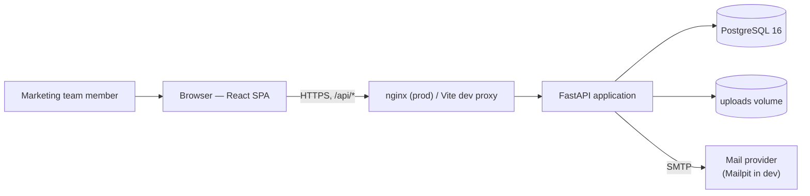
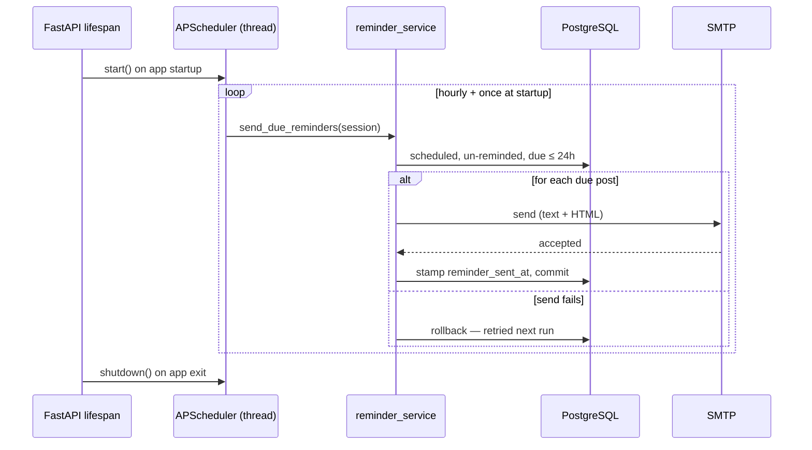
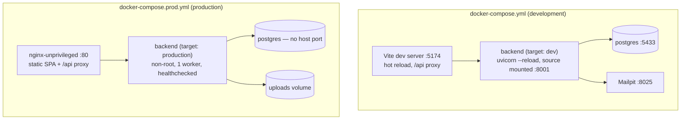

# NextPost — Architecture

This document explains how the system fits together in more depth than the README.
Decision rationale lives in the [ADRs](adr/); this is the "how", they are the "why".

## System context

One origin from the browser's point of view: the SPA and the API share a host, with
`/api/*` proxied to the backend. The browser never talks to the backend directly, which
keeps CORS out of the picture entirely.

## Backend

### Layering

| Layer | Location | Rule |
|---|---|---|
| Routes | `app/api/routes/` | HTTP only: parse/validate input, call one service function, map domain exceptions to status codes |
| Services | `app/services/` | All business logic; take a `Session`, raise domain exceptions, never import FastAPI |
| Models | `app/models/` | SQLAlchemy 2.0 typed ORM; schema conventions in [ADR 0005](adr/0005-database-schema-conventions.md) |
| Schemas | `app/schemas/` | Pydantic v2 request/response models, separate from ORM models |

There is no repository layer between services and SQLAlchemy ([ADR 0002](adr/0002-sync-sqlalchemy.md)
context): with six tables and one developer, the `Session` is the data-access abstraction,
and adding another would be indirection without benefit.

**Ownership is the security boundary.** Every post and tag carries `user_id`; every service
query filters on it. Requesting another user's resource is indistinguishable from
requesting a nonexistent one (404), so IDs can't be probed.

### Request lifecycle (create post)

1. `POST /api/v1/posts` — Pydantic validates shape, lengths, enum values, tag
   normalisation, and the cross-field rule *scheduled ⇒ has a date*.
2. `get_current_user` dependency decodes the Bearer JWT and loads the user.
3. `post_service.create_post` resolves tag names to rows (creating missing ones), stamps
   `published_at` if the post is born published, commits.
4. The route returns the ORM object through `PostRead`; the DB's CHECK constraints are the
   final guarantee behind the schema validation.

### Authentication

Single 12-hour JWT ([ADR 0003](adr/0003-single-jwt-access-token.md)): `sub` is the user id,
HS256-signed with `SECRET_KEY` (the app refuses to boot without one). Passwords are
bcrypt-hashed; login verifies against a dummy hash when the email is unknown so response
timing doesn't reveal which accounts exist, and both failure modes return byte-identical
bodies. Logout is client-side token disposal; the trade-offs (no revocation) are in the ADR.

### Background reminders

Idempotent via `reminder_sent_at`, at-least-once by design
([ADR 0010](adr/0010-reminder-delivery-semantics.md)), and the reason the backend runs
exactly one worker in production ([ADR 0004](adr/0004-apscheduler-for-background-jobs.md)).
The scheduler knows nothing about HTTP; the services know nothing about APScheduler.

### Image pipeline

All filesystem access lives in `image_service`
([ADR 0009](adr/0009-image-storage-and-serving.md)). Upload: extension allow-list → 5 MB
cap (the route reads limit+1 bytes, never buffering more) → Pillow `verify()` → stored
under a UUID filename whose extension comes from the *decoded* format, so the served MIME
type is always truthful. Replacement stores the new file before unlinking the old;
deleting a post deletes its file. Serving is authenticated (`GET /posts/{id}/image`), which
is why the frontend fetches image bytes through Axios and renders object URLs — ``
tags can't send Authorization headers.

### Logging

Structured JSON on stdout: every request (method, path, status, duration), auth events,
post lifecycle events, and reminder-job results (per-send + run summaries), each with an
`event` key and `user_id`/`post_id` where relevant. Passwords, hashes and tokens are never
logged. Production containers rotate logs (json-file, 10 MB × 3).

## Frontend

**State ownership** ([ADR 0007](adr/0007-frontend-state-and-forms.md)): TanStack Query is
the single source of truth for server data — posts, tags, profile, dashboard, image blobs —
with central query keys and invalidation on mutation. React Context holds the auth token
and login/register/logout, nothing else; the current user is just a query. Logout clears
the whole query cache.

**Forms**: React Hook Form everywhere; the post form does cross-field validation
(scheduled ⇒ date), distinguishes "absent" from "explicitly null" on PATCH, and maps
FastAPI 422 responses onto the offending fields via a shared helper.

**Routing**: public routes (login/register) redirect authenticated users in; everything
else sits behind a guard that remembers where you were heading and returns you there after
login. The route tree is exported separately (`AppRoutes`) so tests mount it in a
`MemoryRouter`.

**Calendar** ([ADR 0008](adr/0008-custom-month-calendar.md)): `buildMonthGrid` computes
Monday-first weeks; `MonthCalendar` renders a semantic `<table>` with day-number buttons
(post counts in their accessible names) and status-coloured post chips. Data comes from the
normal list endpoint's `scheduled_from/to` filters — no calendar-specific API. Timezone
display is correct by construction: ISO UTC strings become local `Date`s at render.

## Testing

Full strategy in [ADR 0011](adr/0011-testing-strategy.md). In one paragraph: backend tests
(~120) run against a real PostgreSQL with per-test transaction rollback — no mocked
persistence; only SMTP and the scheduler are stubbed. Frontend tests (~40) mock exactly one
seam (the `src/api/*` modules) and include two workflow tests that walk the real route tree
through login → create → edit → delete. Coverage reports are used to find untested
behaviour, not as a target.

## Development vs production

Both stacks build from the same Dockerfiles (multi-stage targets,
[ADR 0012](adr/0012-production-containerisation.md)), so dev and prod can't drift.
Production publishes exactly one port (nginx), runs every container as a non-root user,
healthchecks db/backend/frontend, and keeps all state in the `pgdata` and `uploads` named
volumes. Migrations are an explicit deploy step, not app-startup magic.

## ADR index

| # | Title |
|---|---|
| [0001](adr/0001-record-architecture-decisions.md) | Record architecture decisions |
| [0002](adr/0002-sync-sqlalchemy.md) | Synchronous SQLAlchemy instead of async |
| [0003](adr/0003-single-jwt-access-token.md) | Single JWT access token, no refresh tokens |
| [0004](adr/0004-apscheduler-for-background-jobs.md) | APScheduler in-process instead of Celery + Redis |
| [0005](adr/0005-database-schema-conventions.md) | Database schema conventions |
| [0006](adr/0006-list-endpoint-conventions.md) | List endpoint conventions |
| [0007](adr/0007-frontend-state-and-forms.md) | Frontend state management and forms |
| [0008](adr/0008-custom-month-calendar.md) | Custom month calendar instead of a library |
| [0009](adr/0009-image-storage-and-serving.md) | Image storage and authenticated serving |
| [0010](adr/0010-reminder-delivery-semantics.md) | Reminder delivery semantics |
| [0011](adr/0011-testing-strategy.md) | Testing strategy |
| [0012](adr/0012-production-containerisation.md) | Production containerisation |
| [0013](adr/0013-continuous-integration.md) | Continuous integration scope |
