# Database schema

## Entity relationship diagram

```mermaid
erDiagram
    users ||--o{ posts : "owns"
    users ||--o{ tags : "owns"
    posts }o--o{ tags : "post_tags"

    users {
        int id PK
        varchar_255 email UK "unique, indexed"
        varchar_255 hashed_password
        varchar_100 full_name
        timestamptz created_at
        timestamptz updated_at
    }

    posts {
        int id PK
        int user_id FK "ON DELETE CASCADE"
        varchar_200 title
        text content
        varchar_20 platform "facebook | instagram | x | linkedin | tiktok | other"
        varchar_20 status "draft | scheduled | published"
        timestamptz scheduled_at "nullable"
        timestamptz published_at "nullable"
        varchar_255 image_path "nullable"
        timestamptz reminder_sent_at "nullable"
        timestamptz created_at
        timestamptz updated_at
    }

    tags {
        int id PK
        int user_id FK "ON DELETE CASCADE"
        varchar_50 name "unique per user"
        timestamptz created_at
        timestamptz updated_at
    }

    post_tags {
        int post_id PK, FK "ON DELETE CASCADE"
        int tag_id PK, FK "ON DELETE CASCADE"
    }
```

## Design decisions

**Ownership is the security boundary.** There are no teams or roles: every post and every tag
belongs to exactly one user, and every query is scoped by `user_id`. Requesting another user's
post returns 404, not 403, so post IDs cannot be probed.

**Enums are stored as `VARCHAR` + CHECK constraint** (`native_enum=False`), not native
PostgreSQL enum types. Adding a value later is a simple constraint swap in a migration instead
of `ALTER TYPE`, which has awkward transactional restrictions.

**`scheduled_at` is nullable, guarded by a CHECK constraint.** A draft may not have a date yet,
but the constraint `status != 'scheduled' OR scheduled_at IS NOT NULL` makes it impossible to
mark a post as scheduled without one — enforced by the database, not just application code.

**`published_at` is set manually.** Publishing is a deliberate user action (teams sometimes
publish after the planned date, e.g. around holidays), so the app records when the user marked
the post published rather than assuming `scheduled_at` was honoured.

**`reminder_sent_at` provides idempotency for reminder emails.** The background job selects
posts scheduled within the next day where `reminder_sent_at IS NULL` and stamps the column when
the email is sent, so restarts never double-send.

**Tags are per-user** (`UNIQUE (user_id, name)`), matching the ownership model. The
`post_tags` join table has a composite primary key, which also serves as its index.

**Indexes** target the actual read paths: `(user_id, scheduled_at)` for the calendar month
query and reminder lookups, `(user_id, status)` for dashboard counts and list-view filters,
and the unique index on `email` for login.

**All timestamps are `timestamptz`** (UTC in the database; the frontend localises for display).
`created_at` / `updated_at` are maintained by the database via `server_default=now()`.
